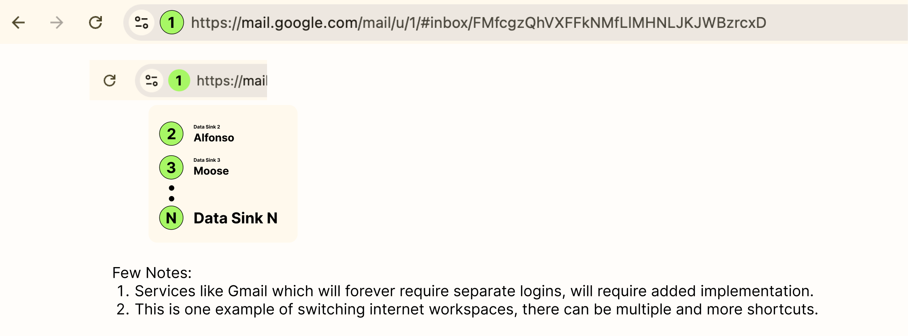
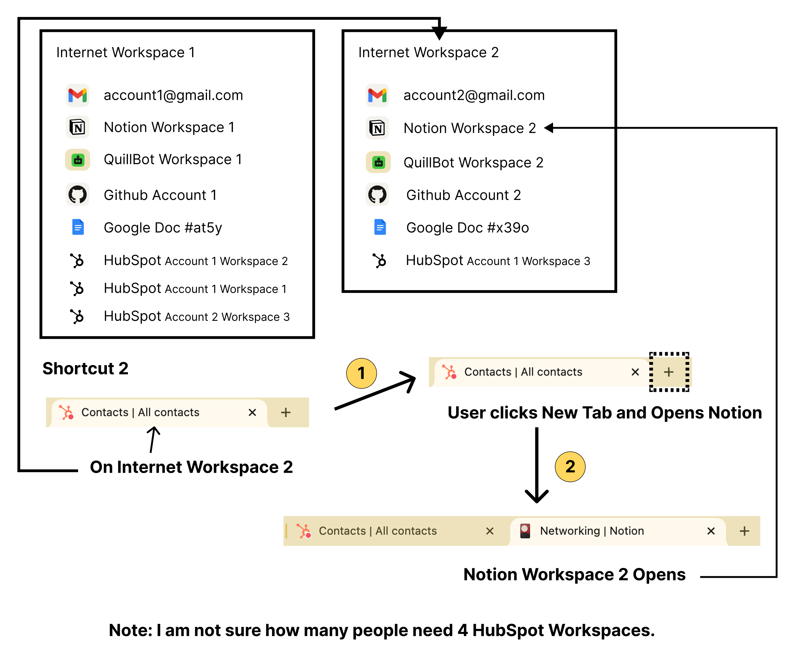

## Why do we need 2 internets?
### Why do we need to access two separate internet workspaces independently from the same browser?
# Would you want to open two Notion WebApps without two logins? 
## What's your favorite app that you want to have 2 copies of? We can make their access easier. 

> The simple ability to open two sets (or more) of websites, with minimal effort, much less than authenticating for it, is going to make my life on the internet _happy_. This can be understood as 2 benefits.

## 2 benefits
### Benefit 1
- We are reducing tapping
- The obvious one. On social media we already have multiple accounts per app. I have many many instagram accounts. I spend so much time on instagram at times, it is very convenient to change profiles through the instagram interface itself. I don't mind.
- *But when we are on app and web-apps where we spend less time, we would prefer it to be automatic.*
- This done across the web is a lot of taps saved.
### Benefit 2 - the more potent one
- I am forever working on projects. I got this idea when I had reached the limits of organizing stuff on my laptop. I wanted to have 2 separate internets on the same device. To manage multiple projects and the associated apps as separate existences.
- With this protocol or implementation, the internet workspace remembers my default data sinks/accounts particular to a project or mental theme in my mind. I can segregate two important things, or more important things, and keep building, and keep innovating - without worrying about switching web accounts, and mentally linked websites.

## Product Sense
### The same URL on the browser tab is hit.

### Shortcut 2

## When We Use EI: The outcome of the capability

### Not concerned about EI
If I am browsing the internet today, I might need to get the url from browser recommendation, by the act of typing a few characters...

Similarly when I am on tomorrow’s internet, I will do the same thing but sometimes with the added idea of which data sink I am expecting to open up...

Which doesn’t mean all my activity would be in expectation of opening a data sink I want...

All intelligence, search, social, backlinks will remain as it is

I wouldn’t care to change the data sink of every possible website that provides that function

Probably, want to keep accessing intelligence, search, social, backlinks as it is

Maybe some I expect to open a particular data sink on each different internet workspace

### Concerned about EI
But there would be times I would be actively organising the websites I want on a particular internet workspace

These would be times when I want to separate a project from my future activity

If I am currently starting a new project, I might start a new internet workspace as well

These are two events when I will be more concerned about the workspace capability the internet provides
- Starting a Project
- Just Saving my Progress

What the conclusion I bring here is, we need to think about the internet as two activities and enable them both to happen for the user
- When they are concerned about the internet workspaces, that activity should be available on hand when the thought arises
- When they are not concerned about the internet workspaces, that activity should be achievable when the IE functionality just doesn’t seem to exist

# Money
- If users don't pay for this willingly: ISPs or others can sell it as default add-on inclusive of current pricing
- If some users pay for this willingly: Nobody can incentivize corporations to adopt easily, real user requirement research would tell the story
- If users prefer to pay for this: There can be a change which happens without force

# Tech

### Technical Requisite
##### Definitions
- Firm Workspace: A Website/Company Providing Two (or more) Different Data Sinks under the same login
- User Workspace: A set of websites which the user decides to create differently on the internet under 2 internet workspaces making their access faster and lives capable 
 
#### Companies
- Companies do provide separate and N number of workspaces under the same login
- Yet, the access requires "effort". You have to manually select and have the second space opened.
- You have to open a new browser tab and again select and load the first workspace, to have 2 spaces on the the same browser window.
- If this can be faster for the user, the user experience gets better.
- More firms can provide 2 workspaces on the same login, if this becomes a capability.

#### User
- Only the user can discern which 2 internets he is working on and individual firms can't
- I call it 2 internets as a slang, a more real label is 2 user workspaces on the internet
- Each internet has a set of websites and default firm workspaces opened on them
- The user has this mapped in their brain, and thus can do more on the internet

> Companies can't differentiate which data sink or firm workspace does the user store separately as part of a wider project, as part of a wider identity in their brain. And this wider project or identity consists of many different websites/company products used by them. 

> Once the user has switched projects or identities, they need to navigate only that part of the internet which is relevant but without doing "effort" such as segregating different logins or manually selecting and loading the right data sink after login.

