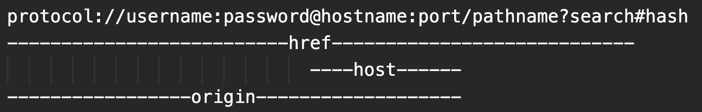

## Problem Statement
To implement a new feature of the internet that allows users to define which part of it is for which project/thinking space to possibly have expanded utility of the web but in the environment of incredible complexity the web has. 

## What’s missing from the web

The browser doesn’t store history linked to an “‘id’, it just stores history. When an ‘id’ is connected to the history, multiple histories can emerge, for the history that is tied to its ‘id’. Consider these ‘ids’ to be integers. 

The user remembers them, and can switch between them on the browser. btw, This is equivalent to switching thinking spaces on the browser. 

As each ‘id’ represents a different history, they can be shown separate suggestions linked to that ‘id’. Now let’s take this a step further. 

 
Imagine it to be (Let's assume this anatomy of a URL os used as it is)

#### protocol://username:password:<ins>id</ins>@hostname:port/pathname?search#hash

When the user switches the ‘id’ from the interface, a new “data sink” is activated on the host. Instead of having a different username, password for each data sink. The ‘id’ works as a multi-value switch.

### What is a data sink?
A data sink is a label for a different account or workspace independent of other such accounts/workspaces. Because each account/workspace uses different data and is the end point of difference of these accounts, I am calling it "data sink".

But that is not the complete problem.
- A ‘id’ for the server, is not the same as an ‘id’ for the user. The user workspace can have multiple server ‘ids’.
- So there are two types of ‘ids’. One for the user, one for the Server.
- **There are other things as well**
  - a
  - b
  - c
  - d
